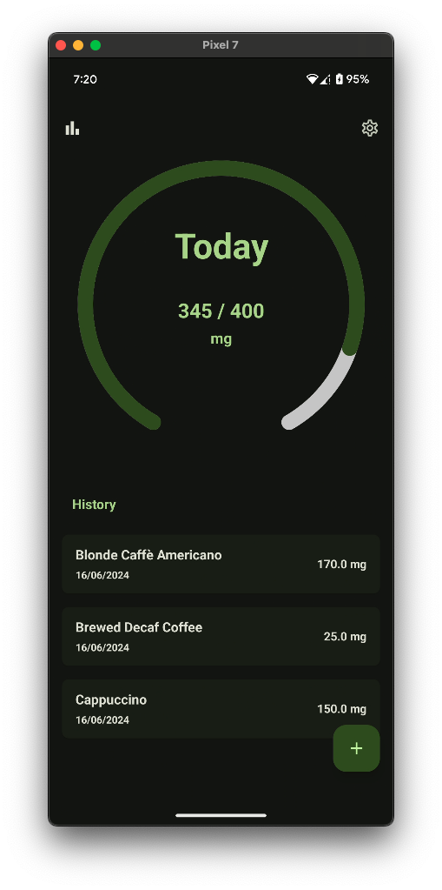
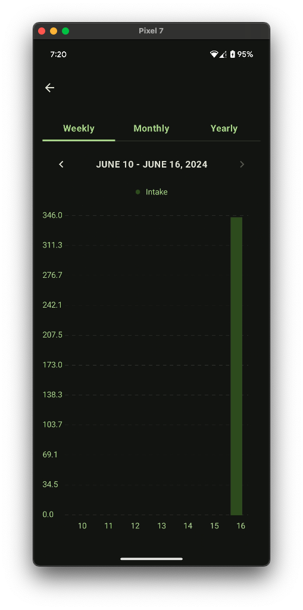
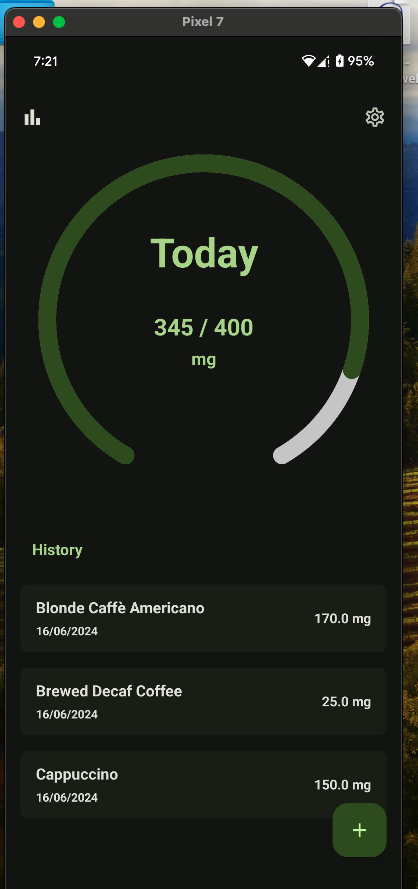
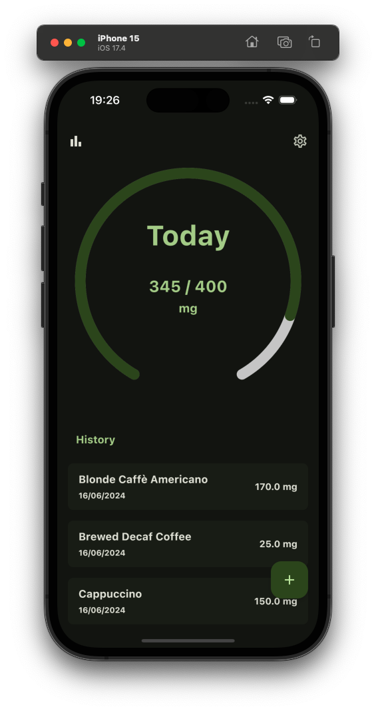

<H1>Caffeine Intake Tracker</H1>

Track your caffeine intake!

## Supported Platforms
- Android
- IOS

## Stack
- 🍎 Shared UI - [Compose Multiplatform](https://github.com/JetBrains/compose-multiplatform)
- 🚏 Navigation - [Androidx](https://www.jetbrains.com/help/kotlin-multiplatform-dev/compose-navigation-routing.html#sample-project)
- 🏗 ViewModel - [Androidx](https://touchlab.co/kmp-viewmodel)
- 📦 Storage - [Room](https://developer.android.com/kotlin/multiplatform/room)
- 💉 Dependecy Injection - [Koin](https://github.com/InsertKoinIO/koin)

##

<pre>
<h2 align="center">Android</h2>
</pre>

  
  

<pre>  
<h2 align="center">IOS</h2>
</pre>

  
  

